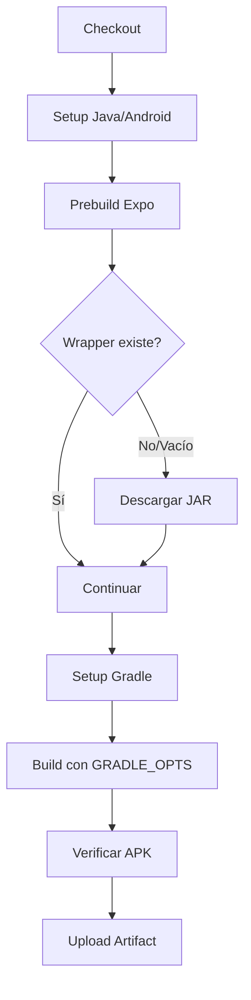

# Corrección del Error de Gradle Wrapper en CI/CD

## Problema Identificado

El workflow `android-native.yml` fallaba con el error:
```
Error: Unable to access jarfile /home/runner/work/Radio-chile-glass/Radio-chile-glass/android/gradle/wrapper/gradle-wrapper.jar
Error: Process completed with exit code 1.
```

### Causas Raíz

1. **Archivo gradle-wrapper.jar corrupto o vacío** en el repositorio Git
2. **Exceso de memoria** durante la compilación nativa de Gradle
3. **Falta de validación** del wrapper antes de ejecutar el build

## Soluciones Implementadas

### 1. Validación y Descarga Automática del Wrapper

Se agregó un paso intermedio que:
- Verifica si `gradle-wrapper.jar` existe y no está vacío
- Extrae la versión de Gradle desde `gradle-wrapper.properties`
- Descarga automáticamente el JAR correcto si falta
- Muestra información del archivo para debugging

```yaml
- name: Ensure Gradle wrapper exists
  working-directory: android
  run: |
    set -euo pipefail
    if [ ! -f "gradle/wrapper/gradle-wrapper.jar" ] || [ ! -s "gradle/wrapper/gradle-wrapper.jar" ]; then
      echo "Gradle wrapper JAR missing or empty, regenerating..."
      rm -rf gradle/wrapper
      mkdir -p gradle/wrapper
      GRADLE_VERSION=$(grep distributionUrl gradle/wrapper/gradle-wrapper.properties | sed 's/.*gradle-\([0-9.]*\).*/\1/')
      echo "Downloading Gradle wrapper for version $GRADLE_VERSION"
      curl -fsSL -o gradle/wrapper/gradle-wrapper.jar \
        "https://raw.githubusercontent.com/gradle/gradle/v${GRADLE_VERSION}/gradle/wrapper/gradle-wrapper.jar" || \
      curl -fsSL -o gradle/wrapper/gradle-wrapper.jar \
        "https://services.gradle.org/distributions/gradle-${GRADLE_VERSION}-bin.zip"
    fi
    chmod +x gradlew
    ls -lh gradle/wrapper/
```

### 2. Optimización de Memoria para CI

Se configuró `GRADLE_OPTS` para entornos con recursos limitados:

```yaml
env:
  GRADLE_OPTS: "-Xmx1024m -XX:MaxMetaspaceSize=256m -XX:+UseSerialGC -Dorg.gradle.parallel=false -Dorg.gradle.workers.max=1"
```

**Beneficios:**
- Reduce el heap de JVM de 2048m a 1024m
- Limita Metaspace a 256m
- Usa GC serial (menor overhead)
- Deshabilita builds paralelos
- Limita workers a 1

### 3. Exclusión del Wrapper en .gitignore

Se agregó `android/gradle/wrapper/gradle-wrapper.jar` al `.gitignore` para:
- Evitar commits accidentales del JAR (~43KB)
- Forzar descarga limpia en cada CI
- Prevenir corrupción por merge conflicts

**Nota:** El directorio `gradle/wrapper/` se mantiene en Git, solo se excluye el JAR.

### 4. Mejora en Comandos Gradle

- Se agregó `--console=plain` para mejor logging en CI
- Se mantiene `--no-daemon` para evitar procesos colgados
- Se mantiene `--stacktrace` para debugging de errores

## Archivos Modificados

1. `.github/workflows/android-native.yml` - Nuevo paso de validación + optimización de memoria
2. `.gitignore` - Excluye `gradle-wrapper.jar`

## Flujo Resultante



## Pruebas Recomendadas

Ejecutar localmente para verificar:

```bash
# Simular condiciones de CI
cd android
rm gradle/wrapper/gradle-wrapper.jar
./gradlew --no-daemon --console=plain assembleRelease
```

## Alternativa: Usar EAS Build

Para builds más estables y sin problemas de memoria, usar el workflow `android-apk.yml` que delega a EAS Build en la nube:

```bash
pnpm build:android:release  # Usa EAS cloud
```

## Referencias

- [Gradle Wrapper Documentation](https://docs.gradle.org/current/userguide/gradle_wrapper.html)
- [GitHub Actions Memory Limits](https://docs.github.com/en/actions/using-github-hosted-runners/about-github-hosted-runners#supported-runners-and-hardware-resources)
- [Expo Prebuild Documentation](https://docs.expo.dev/workflow/prebuild/)
